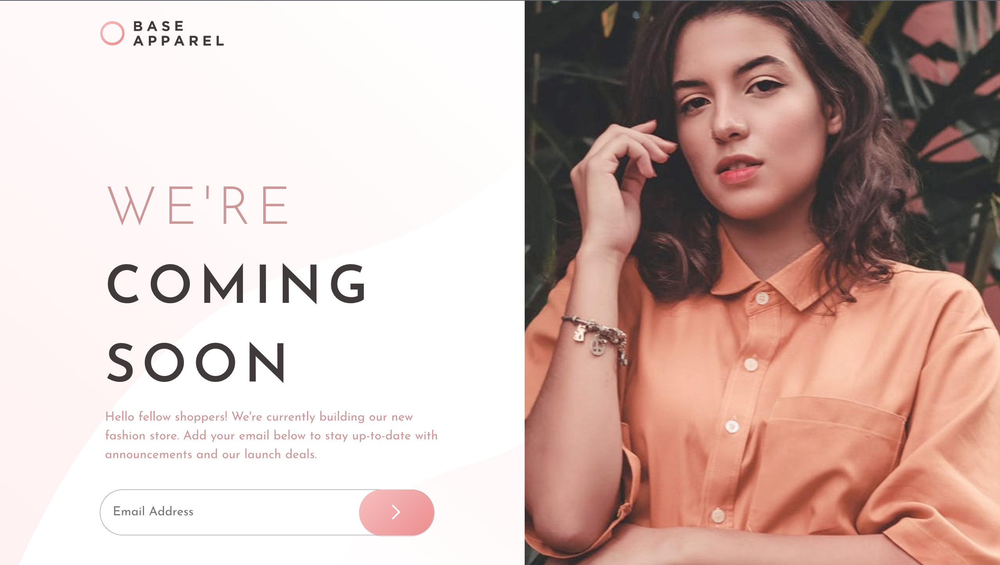

# Frontend Mentor - Base Apparel coming soon page solution

This is a solution to the [Base Apparel coming soon page challenge on Frontend Mentor](https://www.frontendmentor.io/challenges/base-apparel-coming-soon-page-5d46b47f8db8a7063f9331a0). Frontend Mentor challenges help you improve your coding skills by building realistic projects.

## Table of contents

- [Overview](#overview)
  - [The challenge](#the-challenge)
  - [Screenshot](#screenshot)
  - [Links](#links)
- [My process](#my-process)
  - [Built with](#built-with)
  - [What I learned](#what-i-learned)
  - [Continued development](#continued-development)
  - [Useful resources](#useful-resources)
- [Author](#author)
- [Acknowledgments](#acknowledgments)

**Note: Delete this note and update the table of contents based on what sections you keep.**

## Overview

### The challenge

Users should be able to:

- View the optimal layout for the site depending on their device's screen size
- See hover states for all interactive elements on the page
- Receive an error message when the `form` is submitted if:
  - The `input` field is empty
  - The email address is not formatted correctly

### Screenshot

### Links

- Solution URL: [repo](https://github.com/elizabethrsotomayor/base-apparel-coming-soon)
- Live Site URL: [site](https://elizabethrsotomayor.github.io/base-apparel-coming-soon/)

## My process

### Built with

- Semantic HTML5 markup
- CSS custom properties
- Flexbox
- Mobile-first workflow

### What I learned

I gained more experience with flexbox and creating a responsive design for all screen sizes. I initially wanted to use relative and absolute positioning for the overlay effect on the submit button but ended up using percentage values for the margin instead to achieve the same effect. I was going to add some JavaScript for form validation but adding the required parameter to the email input took care of it for me.

### Continued development

I want to experiment more with CSS box-shadow to achieve the shadow effect seen in the design specifications.

### Useful resources

- [CSS Tricks Flexbox Cheat Sheet](https://css-tricks.com/snippets/css/a-guide-to-flexbox/)
- [Stack Overflow How to Keep Layout Uniform Across Screen Sizes](https://stackoverflow.com/questions/6701205/how-to-keep-layout-uniform-across-screen-sizes)

## Author

- Website - [Elizabeth Sotomayor](https://elizabethrsotomayor.github.io/somyo2/)
- Frontend Mentor - [@elizabethrsotomayor](https://www.frontendmentor.io/profile/elizabethrsotomayor)
- Twitter - [@lahijadelmar\_](https://www.twitter.com/lahijadelmar_)
